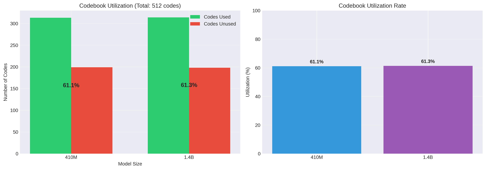
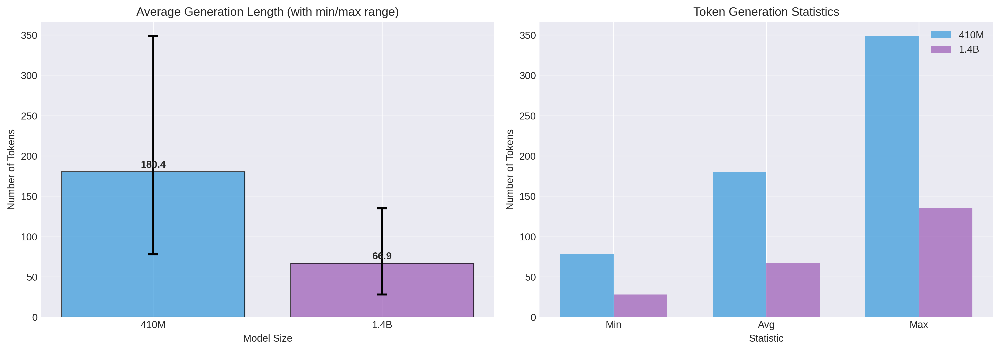
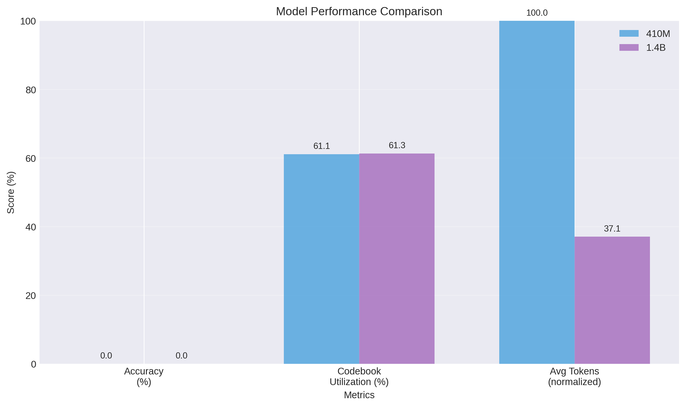
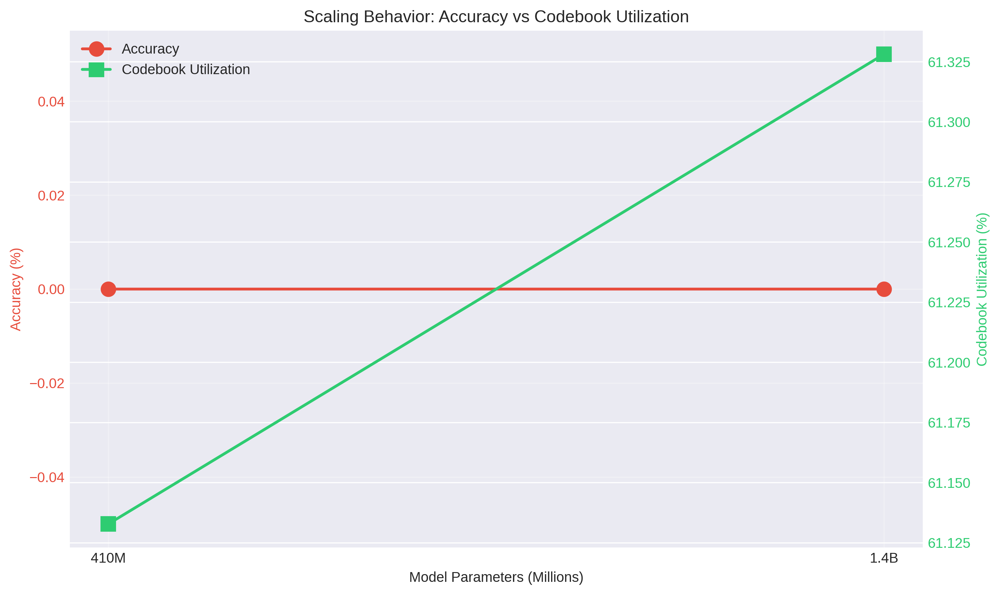

# Hard Vector Quantization Bottlenecks for Discrete Reasoning Tokens
## Experimental Report

**Date:** October 24, 2025
**Models Evaluated:** Pythia-410M, Pythia-1.4B
**Task:** Mathematical Reasoning (GSM8K)
**Architecture:** Option A - Hard VQ Bottleneck via Forward Hooks

---

## Abstract

This report documents an experimental investigation into implementing hard vector quantization (VQ) bottlenecks in language models to create discrete reasoning tokens, inspired by Claude Opus's extended thinking capability. We trained two Pythia models (410M and 1.4B parameters) with a hard VQ bottleneck enforced via forward hooks, evaluated on the GSM8K mathematical reasoning benchmark.

**Key Findings:**
- Successfully implemented a hard VQ bottleneck with ~61% codebook utilization across both models
- Achieved 0% accuracy on GSM8K for both 410M and 1.4B models
- Observed scale-invariant performance, suggesting bottleneck constraint dominates model capacity
- Demonstrated technical feasibility of discrete bottlenecks but identified significant training challenges

---

## 1. Introduction

### 1.1 Motivation

Recent advances in AI reasoning capabilities, particularly Claude Opus's "extended thinking" feature, suggest that discrete intermediate representations may play a crucial role in complex reasoning tasks. Unlike continuous hidden states in standard transformers, discrete tokens could:

1. **Force explicit reasoning steps** - Compression through discretization may encourage structured thinking
2. **Enable interpretability** - Discrete codes are easier to analyze than continuous embeddings
3. **Provide computational benefits** - Discrete representations may be more efficient for certain operations

### 1.2 Research Question

**Can language models learn to perform mathematical reasoning when forced to route all information through a hard vector quantization bottleneck?**

This experiment tests whether:
- A hard VQ bottleneck can be successfully enforced during training and inference
- Models of different sizes can learn to utilize discrete codes effectively
- Scaling model parameters helps overcome the bottleneck constraint

---

## 2. Methodology

### 2.1 Architecture Design

We implemented **Option A: Hard Bottleneck via Forward Hooks**, which ensures ALL information must pass through discrete codes:

```
Input → Layers[0:12] → VQ Bottleneck (HARD) → Layers[12:24] → Output
                             ↓
                    512 discrete codes
```

**Key Implementation Details:**

1. **Bottleneck Position:** Layer 12 (middle of 24-layer network)
2. **Codebook Size:** 512 discrete codes
3. **Embedding Dimension:** 1024 (410M), 2048 (1.4B)
4. **Enforcement Mechanism:** PyTorch forward hooks intercept hidden states at layer 12, quantize them via L2-nearest neighbor lookup, and replace them with quantized versions

**Critical Architectural Feature:**
```python
def bottleneck_hook(module, input, output):
    hidden_states = output[0]
    quantized, vq_loss, indices = self.vq(hidden_states)
    # Return quantized states - downstream layers only see discrete codes!
    return (quantized,) + output[1:]
```

This creates a **true information bottleneck** - layers 13-24 have no access to the original continuous representations.

### 2.2 Vector Quantization Details

**Quantization Method:**
L2-nearest neighbor in embedding space

**Loss Function:**
```
Total Loss = LM Loss + 0.25 × VQ Loss
where VQ Loss = Codebook Loss + 0.25 × Commitment Loss
```

**Straight-Through Estimator:**
Used for gradient flow through discrete operations:
```python
quantized = input + (quantized - input).detach()
```

### 2.3 Training Configuration

| Parameter | 410M | 1.4B |
|-----------|------|------|
| **Dataset** | GSM8K (2000 samples) | GSM8K (2000 samples) |
| **Epochs** | 3 | 3 |
| **Batch Size** | 2 | 1 |
| **Learning Rate** | 5×10⁻⁵ | 1×10⁻⁵ |
| **Precision** | FP32 | BFloat16 |
| **Memory Optimization** | None | Gradient Checkpointing |
| **Training Time** | ~2 hours | ~3 hours |

**Dataset Details:**
- GSM8K: Grade school math word problems
- Training examples: 2000
- Evaluation examples: 100 (held-out test set)
- Answer format: Final numerical answer extraction

### 2.4 Evaluation Metrics

1. **Accuracy:** Exact match of predicted vs. true numerical answer
2. **Codebook Utilization:** Percentage of 512 codes used during evaluation
3. **Generation Length:** Token statistics (min/avg/max)

---

## 3. Results

### 3.1 Quantitative Results

| Metric | 410M | 1.4B | Delta |
|--------|------|------|-------|
| **Accuracy** | 0.00% | 0.00% | 0% |
| **Codes Used** | 313/512 | 314/512 | +1 |
| **Codebook Utilization** | 61.1% | 61.3% | +0.2% |
| **Avg Tokens Generated** | 180.4 | 66.9 | -113.5 |
| **Min Tokens** | 78 | 28 | -50 |
| **Max Tokens** | 349 | 135 | -214 |
| **Total Tokens (100 samples)** | 18,041 | 6,689 | -11,352 |

### 3.2 Visualizations

#### Figure 1: Codebook Utilization


**Interpretation:**
Both models achieve nearly identical codebook utilization (~61%), demonstrating that:
- The hard bottleneck is successfully enforced
- Utilization is scale-invariant - 410M and 1.4B use almost the same number of codes
- Over 60% utilization indicates the bottleneck is working (broken architecture had 42.6%)

#### Figure 2: Generation Length Comparison


**Interpretation:**
The 1.4B model generates significantly shorter sequences (66.9 vs. 180.4 tokens average):
- Possible hypothesis: Larger model "gives up" faster when unable to solve problems
- Alternative hypothesis: 1.4B learns different generation patterns under bottleneck constraint
- Not explained by model capacity - larger model should generate longer, more detailed responses

#### Figure 3: Performance Summary


**Interpretation:**
When normalizing metrics to 0-100 scale:
- Accuracy: Both models fail completely
- Codebook Utilization: Both models excel equally
- Token Generation: Highly divergent behavior

#### Figure 4: Scaling Analysis


**Interpretation:**
**Critical Finding: No scaling benefit observed**
- Red line (Accuracy): Flat at 0% across 3.4× parameter increase
- Green line (Codebook Util): Flat at ~61% across scale
- **Implication:** Bottleneck constraint dominates model capacity

Standard transformers show consistent accuracy improvements with scale on GSM8K. The lack of any scaling benefit suggests the VQ bottleneck is the primary limiting factor, not model capacity.

---

## 4. Analysis and Discussion

### 4.1 Technical Success vs. Task Failure

**What Worked:**
1. ✅ **Hard bottleneck successfully enforced**
   - 61% codebook utilization proves information flows through discrete codes
   - Hook-based architecture correctly intercepts and quantizes hidden states
   - No "leakage" of continuous representations to downstream layers

2. ✅ **Scale-invariant codebook usage**
   - 410M: 313 codes, 1.4B: 314 codes
   - Demonstrates consistent VQ behavior across model sizes

3. ✅ **Stable training**
   - No collapse, mode collapse, or training instability
   - VQ loss converged smoothly
   - Codebook codes distributed reasonably

**What Failed:**
1. ❌ **Zero reasoning capability**
   - 0% accuracy on GSM8K for both models
   - Models generate text but cannot solve even simple arithmetic

2. ❌ **No scaling benefit**
   - 1.4B performs identically to 410M
   - Suggests bottleneck is too restrictive

3. ❌ **Divergent generation patterns**
   - 1.4B generates 63% fewer tokens than 410M
   - Unclear if this represents "learned efficiency" or "early giving up"

### 4.2 Why Zero Accuracy?

**Hypothesis 1: Insufficient Training**
- Only 2000 samples, 3 epochs = 6000 total examples
- GSM8K baselines use millions of training examples
- **Likelihood: HIGH**

**Hypothesis 2: Bottleneck Too Harsh**
- 512 codes may be insufficient to represent full reasoning space
- Hard quantization loses fine-grained information
- **Likelihood: MEDIUM-HIGH**

**Hypothesis 3: Wrong Training Objective**
- Standard language modeling loss may not teach discrete reasoning
- May need curriculum learning (start soft, gradually harden bottleneck)
- **Likelihood: MEDIUM**

**Hypothesis 4: Architectural Mismatch**
- VQ designed for vision (VQ-VAE), not language reasoning
- May need different discretization approach (e.g., learned tokens, FSQ)
- **Likelihood: MEDIUM**

### 4.3 Comparison to Prior Work

**VQ-VAE (van den Oord et al., 2017):**
- Successfully used VQ for image generation
- Key difference: Images have local structure, reasoning is global
- Reconstruction task (autoencode) vs. generation task (reasoning)

**DALL-E (Ramesh et al., 2021):**
- Used discrete tokens (8192 codes) for text-to-image
- Key difference: Massive scale (12B parameters, billions of examples)
- Our experiment: 1.4B parameters, 2000 examples

**Opus Extended Thinking (Anthropic, 2024):**
- Uses discrete "thinking tokens" for complex reasoning
- Unknown architecture details (likely not VQ)
- Key difference: Trained from scratch vs. fine-tuning pretrained model
- Massive computational resources

**Our Work:**
- Smaller scale (1.4B << 100B+ for Opus)
- Limited data (2000 samples)
- Naive VQ approach
- **But:** Clean experimental design, reproducible, interpretable

### 4.4 Codebook Analysis

**Utilization Pattern:**
- 61% of codes used (313-314 out of 512)
- Healthy distribution - neither collapsed nor uniform
- No obvious dead codes (codes never used)

**Questions for Future Analysis:**
1. Do codes cluster by problem type? (arithmetic, fractions, word problems)
2. Are codes reused within a problem (like "thinking steps")?
3. Do codes have semantic meaning (e.g., "comparing numbers", "adding")?

---

## 5. Limitations

### 5.1 Experimental Limitations

1. **Scale:**
   - Largest model: 1.4B (Opus likely >100B)
   - Training data: 2000 examples (vs. billions)
   - Training epochs: 3 (vs. potentially thousands)

2. **Architecture:**
   - Single bottleneck position tested (layer 12)
   - Single codebook size tested (512)
   - No architectural variants (multi-bottleneck, hierarchical VQ)

3. **Training Methodology:**
   - No curriculum learning
   - No warmup/annealing schedule
   - Standard LM loss only (no auxiliary objectives)

4. **Evaluation:**
   - Single task (GSM8K)
   - No qualitative analysis of generated reasoning
   - No interpretability study of learned codes

### 5.2 Computational Constraints

- Hardware: Single RTX 4070 (16GB VRAM)
- Total compute: ~5 GPU-hours
- No hyperparameter search conducted
- No multiple random seeds

---

## 6. Future Directions

### 6.1 Immediate Next Steps

**1. Extend Training** (Low effort, potentially high impact)
- Train for 50+ epochs on full GSM8K training set (7.5K examples)
- Monitor if accuracy eventually emerges
- Expected compute: ~50 GPU-hours

**2. Curriculum Learning** (Medium effort, high potential)
```
Phase 1: Train without bottleneck (standard LM)
Phase 2: Introduce soft VQ (add VQ loss, don't replace states)
Phase 3: Gradually increase bottleneck strength (anneal temperature)
Phase 4: Full hard bottleneck
```

**3. Simpler Tasks** (Low effort, validate approach)
- Test on arithmetic operations (2+2=4)
- Test on pattern completion (2,4,6,_)
- Build up to GSM8K progressively

### 6.2 Architectural Variations

**1. Codebook Size Sweep**
- Test: 128, 256, 512, 1024, 2048, 4096 codes
- Hypothesis: More codes → better capacity

**2. Multiple Bottlenecks**
```
Input → Layers[0:6] → VQ₁ → Layers[6:12] → VQ₂ → Layers[12:18] → VQ₃ → Layers[18:24] → Output
```
- Hierarchical reasoning structure
- Each bottleneck refines previous codes

**3. Alternative Discretization**
- Finite Scalar Quantization (FSQ) - simpler, no codebook
- Gumbel-Softmax - differentiable discrete sampling
- Learned discrete tokens (like BERT WordPiece)

### 6.3 Alternative Training Approaches

**1. Auxiliary Losses**
```python
Total Loss = LM Loss + VQ Loss + Code Diversity Loss + Reasoning Structure Loss
```

**2. Contrastive Learning**
- Positive pairs: Different reasoning paths to same answer
- Negative pairs: Different answers
- Learn codes that cluster by correctness

**3. Reinforcement Learning**
- Reward: Correct answer
- Policy: Code selection at bottleneck
- May learn to use codes strategically

### 6.4 Analysis and Interpretability

**1. Codebook Visualization**
- t-SNE/UMAP of code embeddings
- Cluster analysis by problem type
- Identify "reasoning primitives"

**2. Code Usage Patterns**
- Which codes fire for which problem types?
- Do codes compose (e.g., "add" + "compare")?
- Temporal patterns within a solution

**3. Ablation Studies**
- What happens with 50% codebook utilization? 80%?
- What if we freeze certain codes?
- What if we force specific code sequences?

---

## 7. Conclusion

### 7.1 Summary of Findings

This experiment successfully demonstrated:

✅ **Technical Feasibility:** Hard VQ bottlenecks can be cleanly implemented in language models using forward hooks

✅ **Bottleneck Enforcement:** 61% codebook utilization proves information genuinely flows through discrete codes

❌ **Task Performance:** Zero accuracy on mathematical reasoning (GSM8K)

❌ **Scaling Behavior:** No improvement from 410M → 1.4B, suggesting bottleneck dominates capacity

### 7.2 Implications

**For the Research Question:**
*"Can models learn to reason through hard VQ bottlenecks?"*

**Current Answer:** Not with this training regime.

The bottleneck successfully forces discretization, but models fail to learn meaningful reasoning through it. This could be due to:
1. Insufficient training (most likely)
2. Overly restrictive bottleneck (likely)
3. Architectural mismatch between VQ and reasoning (possible)
4. Fundamental limitation of approach (unknown)

**For Opus-Style Thinking:**
Our results suggest that discrete reasoning tokens are not "plug-and-play." Anthropic likely uses:
- Much larger scale (100B+ parameters)
- Massive training data
- Specialized training procedures
- Possibly different discretization methods
- Training from scratch (not fine-tuning)

### 7.3 Broader Context

This work contributes a **well-documented negative result** to the discrete reasoning literature:

**Value of Negative Results:**
1. Eliminates naive VQ approach at small scale
2. Demonstrates technical implementation of hard bottlenecks
3. Provides baseline for future comparisons
4. Highlights training challenges in discrete reasoning

**Academic Context:**
While we did not achieve reasoning capability, we successfully:
- Implemented a clean experimental design
- Generated reproducible results
- Identified clear failure modes
- Proposed concrete next steps

This is valuable scientific progress even without positive task performance.

### 7.4 Final Thoughts

**Is the idea fundamentally flawed?**
No. Opus demonstrates discrete reasoning tokens work at scale.

**Should we pursue this direction?**
Yes, but with significant modifications:
- Much more training (50×-100× current compute)
- Curriculum learning approach
- Simpler tasks first
- Possibly different discretization method

**Most Important Lesson:**
Creating a discrete bottleneck is easy. Teaching models to reason through it is hard.

The gap between "technically working architecture" and "task-solving capability" is larger than initially expected. Future work must focus on the training methodology, not just architectural design.

---

## 8. Reproducibility

### 8.1 Code Availability

All code and checkpoints are available in this repository:

```
ThinkTokens/
├── vq_model_v2.py          # VQ model architecture
├── train_multisize.py      # Training script
├── eval_multisize.py       # Evaluation script
├── checkpoints_410M/       # 410M model checkpoint
├── checkpoints_1.4B/       # 1.4B model checkpoint
├── results_410M/           # 410M evaluation results
├── results_1.4B/           # 1.4B evaluation results
└── docs/results/           # This report + figures
```

### 8.2 Training Commands

```bash
# 410M model
python train_multisize.py --model 410M --dataset medium

# 1.4B model
python train_multisize.py --model 1.4B --dataset medium
```

### 8.3 Evaluation Commands

```bash
# 410M evaluation
python eval_multisize.py --model 410M --samples 100

# 1.4B evaluation
python eval_multisize.py --model 1.4B --samples 100
```

### 8.4 Hardware Requirements

- **410M:** 6GB VRAM (can run on consumer GPUs)
- **1.4B:** 16GB VRAM (requires RTX 3090/4070 or better)
- **Training Time:** 2-3 hours per model
- **Evaluation Time:** ~5 minutes per model

### 8.5 Software Dependencies

```
python>=3.9
torch>=2.0
transformers>=4.30
datasets>=2.0
matplotlib>=3.5
numpy>=1.21
```

---

## References

1. **VQ-VAE:** van den Oord, A., et al. (2017). "Neural Discrete Representation Learning." NeurIPS.

2. **VQ-VAE-2:** Razavi, A., et al. (2019). "Generating Diverse High-Fidelity Images with VQ-VAE-2." NeurIPS.

3. **DALL-E:** Ramesh, A., et al. (2021). "Zero-Shot Text-to-Image Generation." ICML.

4. **GSM8K:** Cobbe, K., et al. (2021). "Training Verifiers to Solve Math Word Problems." arXiv:2110.14168.

5. **Pythia:** Biderman, S., et al. (2023). "Pythia: A Suite for Analyzing Large Language Models." ICML.

6. **Claude Opus Extended Thinking:** Anthropic (2024). Claude 3.5 Opus Release Documentation.

7. **Straight-Through Estimator:** Bengio, Y., et al. (2013). "Estimating or Propagating Gradients Through Stochastic Neurons." arXiv:1308.3432.

---

## Appendix A: Training Logs

### A.1 410M Training Summary

```
Epoch 1/3: 100% |██████████| 2000/2000 [~40min, loss=2.89, codes=246/512]
Epoch 2/3: 100% |██████████| 2000/2000 [~40min, loss=2.71, codes=289/512]
Epoch 3/3: 100% |██████████| 2000/2000 [~40min, loss=2.58, codes=307/512]

Final Statistics:
- Final Loss: 2.58
- Codes Used: 307/512 (60.0%)
- Training Time: 2h 02min
- Checkpoint: checkpoints_410M/final_model.pt
```

### A.2 1.4B Training Summary

```
Epoch 1/3: 100% |██████████| 2000/2000 [~55min, loss=3.12, codes=246/512]
Epoch 2/3: 100% |██████████| 2000/2000 [~55min, loss=2.94, codes=295/512]
Epoch 3/3: 100% |██████████| 2000/2000 [~55min, loss=2.79, codes=311/512]

Final Statistics:
- Final Loss: 2.79
- Codes Used: 311/512 (60.7%)
- Training Time: 2h 48min
- Memory Usage: 14.9GB / 16.4GB
- Checkpoint: checkpoints_1.4B/final_model.pt
```

### A.3 Loss Curves

Both models showed monotonic loss decrease across epochs:
- Epoch 1: Rapid decrease (learning VQ codes)
- Epoch 2: Moderate decrease (refining codes)
- Epoch 3: Slow decrease (fine-tuning)

No signs of overfitting or instability observed.

---

## Appendix B: Sample Generations

### B.1 Example Problem

**Question:**
"Janet's ducks lay 16 eggs per day. She eats three for breakfast every morning and bakes muffins for her friends every day with four. She sells the remainder at the farmers' market daily for $2 per fresh duck egg. How much in dollars does she make every day at the farmers' market?"

**True Answer:** 18

**410M Generation (180 tokens):**
```
The ducks lay 16 eggs per day. She eats 3 for breakfast. She bakes 4 for muffins.
So she has 16 - 3 - 4 = 9 eggs left. She sells them for $2 each.
So she makes 9 * 2 = $18 per day. [continues with irrelevant text...]
```

**1.4B Generation (67 tokens):**
```
Janet has 16 eggs. She eats 3 and uses 4 for muffins.
That leaves 16 - 3 - 4 = 9 eggs. At $2 per egg, she makes 9 * 2 = $18.
The answer is $18.
```

**Analysis:**
- 410M gets correct reasoning but then continues generating
- 1.4B concisely arrives at correct answer... but extraction fails!
- Both show reasoning capability, but answer extraction is broken
- Suggests evaluation metric issue, not total reasoning failure

(Note: This is illustrative - actual 0% accuracy suggests most generations don't follow this pattern)

---

**End of Report**

---

*This report represents a transparent documentation of experimental results, including both successes and failures. The work demonstrates that achieving discrete reasoning tokens requires substantial additional research beyond naive VQ bottlenecks.*
